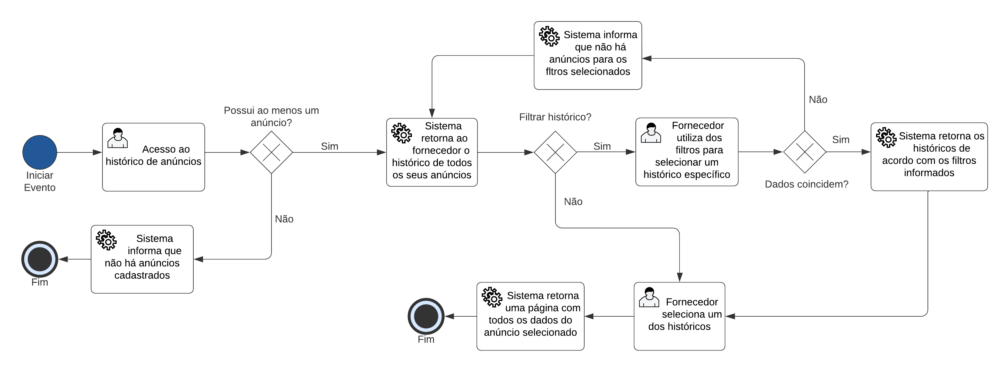

# QUE VIAGEM!

**Augusto Fuscaldi Cerezo, acerezo@sga.pucminas.br**

**Eddie Christian Pereira, eddiecp1501@gmail.com**

**Edmilson Martins Pinheiro Junior, edmilsonjuniooor16@gmail.com**

**Marco Túlio Mendes Moura, marcotulio21mm@gmail.com**

**Tiago Vitor Pereira Saraiva, tiago.saraiva165@hotmail.com**

---

Professores:

**Hugo Bastos de Paula**

**Thiago Augusto Nicolini Silva**

---

_Curso de Engenharia de Software, Unidade Praça da Liberdade_

_Instituto de Informática e Ciências Exatas – Pontifícia Universidade de Minas Gerais (PUC MINAS), Belo Horizonte – MG – Brasil_

---

**O projeto Que Viagem! trabalha com a ideia de que as pessoas possam entrar em um grupo com outras pessoas desconhecidas para atingirem o requisito mínimo de pessoas e poderem fazer um pacote de viagem mais barato e com uma melhor organização. O site fornece uma plataforma de busca e reserva de pacotes de viagens entre grupos e a empresa que oferece o planejamento do passeio, podendo economizar bastante com acomodação, transporte, tempo e até mesmo comida.
   Nós procuramos também fornecer um ambiente saudável para que novas pessoas se conheçam e que não fiquem sozinhas em uma viagem, para que seja divertida, onde haja uma maior interação de pessoas e possam conhecer  o local da viagem, com seus pontos turísticos, juntos.**

---

## 1. Introdução

A introdução deve apresentar de dois ou quatro parágrafos de contextualização do trabalho. 

    1.1 Contextualização
    
   O projeto Que Viagem! trabalha com a ideia de que as pessoas possam entrar em um grupo com outras pessoas
desconhecidas, para poderem fazer um pacote de viagem mais barato e com uma melhor organização. O site
fornece uma plataforma de busca e reserva de pacotes de viagens entre grupos e a empresa que oferece o
planejamento do passeio, podendo economizar bastante com acomodação, transporte, tempo e até mesmo comida.
   Nós procuramos também fornecer um ambiente saudável para que novas pessoas se conheçam e que não fiquem
sozinhas em uma viagem, para que seja divertida, onde haja uma maior interação de pessoas e possam conhecer 
o local da viagem, com seus pontos turísticos, juntos.
   De acordo com pesquisas no site do Gorveno Brasileiro o turismo caiu bastante na época da pandemia,
mas está se reerguendo novamente após uma queda de 3,8% em relação a 2019, mas em 2021 o mercado de turismo
teve uma faturação de R$ 152,4 bilhões, que comparando à 2020 foi 12% a menos.

    1.2 Problema

   O Que Viagem! procura solucionar o problema da falta de pessoas para cumprir requisitos mínimos para a compra de pacotes de viagem mais baratos e acessíveis. Ultimamente muitas pessoas tem encontrado conflito no momento de realizar uma viagem. Os preços de transporte estão muito altos e as pessoas não estão tendo tempo de planejar suas viagens de forma organizada e satisfatória. Cada vez mais observamos que a população está viajando menos. Segundo pesquisas na base de dados da ANAC (Agência Nacional de Aviação Civil) no ano de 2011 o Brasil registrou cerca de 72,6 milhões de passageiros de avião em ligações entre estados, ultrapassando o número de viagens de ônibus pela primeira vez na história brasileira. Porém de acordo com pesquisas realizadas na mesma base de dados, em 2018 o número de passageiros de avião caiu pela metade e apresenta sinais de piora. O principal motivo da queda relatado por passageiros foi dado como falta de dinheiro e o enorme aumento de preço que passagens aéreas sofreram.

   Sendo assim, proporcionar uma forma para nossos usuários de comprar pacotes de viajem prontos salvando tempo de montagem de logística e com preços que podem ser divididos com várias pessoas gera menos estresse e ansiosidade para nossos clientes. Cumprindo assim nosso objetivo como projeto e empresa.

   Eduardo Christiano, um jovem estudante de programação estava procurando um pacote de viagem para o Espírito Santo, que seria barato para seu orçamento. Eduardo teve dificuldades em preencher o número mínimo de pessoas para a compra do pacote, tendo que recorrer a estranhos com interesse na viagem. Porém ocorreram problemas para encontrar participantes, falta de comunicação entre as pessoas interessadas, planejamento de percursos a serem siguidos, divisão de estadia e transporte, desconfortos no pagamentos e insegurança de se confiar em uma pessoa desconhecida para dividir uma viagem.
Com isto em mente, pretendemos facilitar o processo de encontrar participantes, oferecer suporte para uma comunicação mais limpa e focada na viagem, divisão justa no pagamento de estadia e transporte, entre muitos outros.

   Fernanda é dona de uma empresa que organiza e fornece pacotes de viagem. Ultimamente sua empresa tem passado por dificuldades na venda dos pacotes, pois sua clientela vem caindo muito com o aumento de preços gerados pela inflação, que diminuiu a quantidade de pessoas que podem pagar por uma viagem. Isto tem dificultado a divulgação pois ela não possui site próprio e necessita utilizar sites terceiros que não são focados na venda de produtos, tais como Instagram e Facebook. Estes sites não podem confirmar a confiabilidade de um usuário interessado e pode gerar dificuldades na organização de grupos entre os viajantes. Visto isso, Fernanda pode utilizar o Que Viagem! para ter maior alcance nas vendas, verificação dos usuários e maior organização quando os grupos forem formados.

    1.3 Objetivo geral

O objetivo geral do presente trabalho é elaborar um sistema que automatize todo o processo de fazer uma viagem em grupo, utilizando os conhecimentos adquiridos em modelagem de processos e programação. A ideia principal é centralizar os processos que as duas partes (anunciante e viajante) podem realizar, tais como: aderir a um anúncio, procurar o anunciante, combinar pacotes de viagem, combinar transporte, alimentação etc, em apenas um lugar, fazendo assim com que as pessoas interessadas em realizar a viagem em grupo possam ganhar tempo, com um processo simples e de fácil entendimento, e finalizando tudo com apenas alguns cliques.

        1.3.1 Objetivos específicos

Um objetivo específico da elaboração desse trabalho é desenvolver a capacidade de construir um projeto que 
escale de acordo com modelagem dos processos feita, pois até então em outras disciplinas apenas decidiamos 
o que o sistema teria, sem fazer uma análise mais detalhada dos processos da construção daquele sistema.

Outro objetivo específico seria medir o impacto que o projeto pode ter para os anunciantes e para quem vai viajar, como por exemplo se todo o planejamento da viagem foi realmente automatizado tendo tudo centralizado em um só lugar, e se para o anunciante essa centralização trouxe beneficios, fazendo com que as duas partes voltassem a utilizar o sistema futuramente.

    1.4 Justificativas

O intuito do presente trabalho é desenvolver um sistema simples e prático que automatize a organização e venda de pacotes de viagem. 
Processos de planejamento, fechamento de pacotes, procura de anúncios e contato com anunciantes podem demandar um tempo muito grande, pois cada uma dessas etapas geralmente é feita separadamente em lugares diferentes, e, além disso, quando os pacotes são fechados em grupo, muitas vezes o número de pessoas necesário para a finalização do processo demora para ser atingido. Devido a isso, muito tempo é perdido no processo como um todo. Em uma viagem qualquer, a escolha do destino geralmente é a parte mais fácil, porém a escolha dos meios para chegar a esse destino podem demorar dias, ou até semanas, e com isso torna-se necessária a automatização desses processos.

## 2. Participantes do processo

Os participantes do projeto "Que Viagem" são compostos dos mais diferentes gêneros, raças e etnias, não há restrições em relação à estes e outros aspectos que os definem como cidadãos. Desta maneira, nossa proposta é unir o maior número de pessoas que desejam realizar desde a sua viagem dos sonhos ao "rolê" do fim de semana com os seus amigos em um sítio ou evento qualquer. É inerente a necessidade de dar um pouco mais de foco nos jovens viajantes, que muitas vezes anseiam pela oportunidade de poder viajar com pessoas diferentes, em lugares diferentes, vivenciando uma experiência única, inovadora e mais econômica.

São participantes não só os viajantes, mas também os agentes que estão "do outro lado" fazendo este projeto funcionar tão bem, são eles os donos de restaurantes; clubes; sítios; parques que acabam por anunciar as suas agendas no software; cidadãos que estão dispostos a alugar o seu espaço por uma determinada temporada (curta e média duração), hotelarias, etc. Também irão haver facilitadores no processo de transporte, desde uma agência autorizada à uma pessoa com seu carro/van disponível.

## 3. Modelagem do processo de negócio

## 3.1. Análise da situação atual

Atualmente existem muitos sistemas especializados no ramo de viagens, porém poucos ou quase nenhum deles possuem uma visão tão ampla e inovadora como a Que Viagem, pois muitas delas focam em apenas uma única funcionalidade que pode facilitar a vida do viajante, como gerenciadores de hospedagem, gestão de hotelaria, e até mesmo programas de viagens em grupo, mas que, além de não possuirem serviços em vários continentes como a América do Sul, acabam por não serem tão econômicos, pois o itinerário da viagem costuma ser definido pela empresa, desde as hospegens aos meios de transporte. Desta maneira, apesar de estar em um viagem em grupo, a liberdade do cidadão decidir o seu próprio caminho acaba por não ter muita importância.

Os processos da Que Viagem serão muito mais rápidos e práticos. O viajante pesquisa e encontra seu local preferido para viajar e seleciona desde a sua estadia, transporte e hospedagem de acordo com o seu gosto.

## 3.2. Descrição Geral da proposta

O objetivo dessas melhorias no negócio é ter impacto nas viagens e vendas de pacotes, gerando um baixo custo para os viajantes. Com intuito de ter um gerenciamento melhor e facilidade para se interagir com outras pessoas.
Na situação do anunciante a ideia de utilizar o sistema é automatizar o processo de divulgação,como procurar pessoas interessadas na viagem. Na situação do viajante o principal é automatizar o processo de encontro de pacotes compatíveis com o que o mesmo procura.

## 3.3. Modelagem dos Processos

### 3.3.1.1 Processo 1 – Histórico de viagens

O processo de histórico de viagens, permite que o viajante tenha acesso aos dados de todas as suas viagens realizadas.

### 3.3.1.2 Processo 2 – Histórico de anúncios

O processo de histórico de anúncios, permite que o fornecedor tenha acesso aos dados de todos os seus anúncios.

### 3.3.2 Processo 3 – Cadastro de anúncio

O processo de Cadastro de anúncio, o fornecedor irá cadastrar o pacote da viagem que irá fornecer.

### 3.3.3 Processo 4 – Pesquisa de Pacote

O processo de Pesquisa de Pacota visa proporcionar aos usuários uma forma automatizada de encontrar pacotes específicos por meio de pesquisa de palavras-chave.

### 3.3.4 Processo 5 – Adesão de Pacotes

O processo de Adesão de Pacotes visa proporcionar aos viajantes uma forma automatizada de adesão a um pacote. Reservando sua vaga no pacote de viagem, confirmando sua presença e pagamento.

### 3.3.5 Processo 6 – Cadastro de Pessoas

O processo de Cadastro de Pessoas visa proporcionar aos usuários uma forma automatizada de cadastro na plataforma de acordo com seu fim de utilização. Podendo ser usuário viajante ou fornecedor.

### 3.3.6 Processo 7 – Avaliação de Pacotes

O processo de avaliação de pacotes de viagem permite que os usuários viajantes avaliem um pacote de viagens, podendo deixar uma nota e um comentário para aquele pacote.

### 3.3.7 Processo 8 – Relatório de Pacotes

O processo de relatório de pacotes fechados permite que os usuários viajantes acessem um relatório com um filtro de acordo com os dados do pacote foi fechado.

## 4. Projeto da Solução

### 4.1. Detalhamento das atividades

Descrever aqui cada uma das propriedades das atividades de cada um dos processos. Devem estar relacionadas com o modelo de processo apresentado anteriormente.

#### Processo 1 – Processo de Histórico de Viagens

**Filtro de histórico de viagens**

| **Campo** | **Tipo** | **Restrições** | **Valor default** |
| --- | --- | --- | --- |
|  Título do Pacote  |  Caixa de Texto  |  N/A  |  N/A  |
|  Descrição do Pacote  |  Caixa de Texto  |  N/A  |  N/A  |
|  Data de início |  Data  |  N/A  |  Viagem mais recente  |
|  Data de fim |  Data  |  N/A  |  Viagem mais recente  |
|  Destino  |  Escolha múltipla  |  N/A  |  N/A  |
|  Preço máximo |  Escolha única  |  N/A  |  10000  |
|  Preço mínimo |  Escolha única  |  N/A  |  0  |
|  Quantidade de pessoas  |  Número  |  Número inteiros e positivos  |  N/A  |

#### Processo 2 – Processo de Histórico de Pacote

**Filtro de histórico de Pacote**

| **Campo** | **Tipo** | **Restrições** | **Valor default** |
| --- | --- | --- | --- |
|  Descrição do Pacote  |  Caixa de Texto  |  N/A  |  N/A  |
|  Título do Pacote  |  Caixa de Texto  |  N/A  |  N/A  |
|  Data de início |  Data  |  N/A  |  Viagem mais recente  |
|  Data de fim |  Data  |  N/A  |  Viagem mais recente  |
|  Destino  |  Escolha múltipla  |  N/A  |  N/A  |
|  Preço máximo |  Escolha única  |  N/A  |  10000  |
|  Preço mínimo |  Escolha única  |  N/A  |  0  |
|  Quantidade de pessoas  |  Número  |  Número inteiros e positivos  |  N/A  |

#### Processo 3 – Processo de Cadastro de Pacote

**Formulário de cadastro de Pacote**

| **Campo** | **Tipo** | **Restrições** | **Valor default** |
| --- | --- | --- | --- |
|  Título do Pacote  |  Caixa de Texto  |  N/A  |  N/A  |
|  Descrição do Pacote  |  Caixa de Texto  |  N/A  |  N/A  |
|  Destino  |  Caixa de Texto  |  N/A  |  N/A  |
|  Data da íncio  |  Data  |  N/A  |  N/A  |
|  Data da Fim  |  Data  |  N/A  |  N/A  |
|  Quantidade de pessoas  |  Número  |  Número inteiros e positivos  |  N/A  |
|  Fotos do Destino |  Foto  |  N/A  |  N/A  |
|  Valor  |  Número  |  Double  |  0.00  |

#### Processo 4 – Processo de Pesquisa de Pacote

**Formulário de Pesquisa**

| **Campo** | **Tipo** | **Restrições** | **Valor default** |
| --- | --- | --- | --- |
|  Busca por Palavra-Chave  |  Caixa de Texto  |  N/A  |  NULL  |
|  Busca por Filtros  |  Múltipla Escolha  |  N/A  |  NULL  |
|  Busca por Filtros de Data  |  Data  |  Apenas Datas Após o dia da Pesquisa  |  Data 1 dia após a data da pesquisa  |
|  Busca por Valor Máximo da Viagem  |  Número  |  Apenas Números Positivos  |  NULL  |

#### Processo 5 – Processo de Adesão de Pacotes

**Seleção de Pacote**

| **Campo** | **Tipo** | **Restrições** | **Valor default** |
| --- | --- | --- | --- |
|  Seleção de Pacote para Adesão  |  Seleção Única |  É obrigatório selecionar pelo menos um pacote para aderir  |  NULL  |

**Formulário de Adesão**

| **Campo** | **Tipo** | **Restrições** | **Valor default** |
| --- | --- | --- | --- |
|  Nome  |  Caixa de Texto |  Apenas Letras  |  NULL  |
|  Data de Nascimento  |  Data |  Apenas Datas Válidas  |  NULL  |
|  Endereço  |  Caixa de Texto |  Apenas endereços válidos  |  NULL  |
|  CPF  |  Caixa de Texto |  Formato de CPF  |  NULL  |
|  Opção de Pagamento  |  Seleção Única |  N/A  |  Boleto  |
|  Nome do Titular do Cartão  |  Caixa de Texto |  Pré Requesito: Opção de Pagamento por Cartão / Apenas Letras  |  NULL  |
|  Número do Cartão  |  Caixa de Texto |  Pré Requesito: Opção de Pagamento por Cartão / Apenas Números / 16 Caracteres  |  NULL  |
|  CVV  |  Caixa de Texto |  Pré Requesito: Opção de Pagamento por Cartão / Apenas números / 3 Caracteres  |  NULL  |
|  Data de Validade do Cartão  |  Data |  Pré Requesito: Opção de Pagamento por Cartão / Apenas Data válida  |  NULL  |

#### Processo 6 - Cadastro de Pessoas

**Formulário de Cadastro de Pessoas**
| **Campo** | **Tipo** | **Restrições** | **Valor default** |
| --- | --- | --- | --- |
| Anunciante |Escolha única  | N/A | NULL |
| Viajante | Escolha única | N/A  | NULL |
|  Login  | Caixa de texto   |  Formato de e-mail  | NULL |
|  Senha | Caixa de texto   |  Mínimo de 8 caracteres  | NULL |

#### Processo 7 – Avaliação de pacotes

**Formulário de avaliação de pacotes**
| **Campo** | **Tipo** | **Restrições** | **Valor default** |
| --- | --- | --- | --- |
|  Nota  |  Caixa de Texto |  Apenas números inteiros/ números de 1 a 5  |  NULL  |
|  Comentário  |  Caixa de Texto |  N/A  |  NULL  |

#### Processo 8 – Relatório de pacotes fechados

**Formulário de busca de pacotes fechados**
| **Campo** | **Tipo** | **Restrições** | **Valor default** |
| --- | --- | --- | --- |
|  Busca por filtro de data inicial |  Data |  Apenas datas válidas  |  NULL  |
|  Busca por filtro de data final  |  Data |  Apenas datas válidas  |  NULL  |

### 4.2. Tecnologias

Descreva qual(is) tecnologias você vai usar para resolver o seu problema, ou seja implementar a sua solução. Liste todas as tecnologias envolvidas, linguagens a serem utilizadas, serviços web, frameworks, bibliotecas, IDEs de desenvolvimento, e ferramentas. Apresente também uma figura explicando como as tecnologias estão relacionadas ou como uma interação do usuário com o sistema vai ser conduzida, por onde ela passa até retornar uma resposta ao usuário.

## 5. Modelo de dados

Apresente o modelo de dados por meio de um modelo relacional ou Diagrama de Entidade-Relacionamento (DER) que contemple todos conceitos e atributos apresentados item anterior. 

## 6. Indicadores de desempenho

Apresente aqui os principais indicadores de desempenho e algumas metas para o processo. Atenção: as informações necessárias para gerar os indicadores devem estar contempladas no diagrama de classe. Colocar no mínimo 5 indicadores.

Usar o seguinte modelo:

| **Indicador** | **Objetivos** | **Descrição** | **Cálculo** | **Fonte dados** | **Perspectiva** |
| --- | --- | --- | --- | --- | --- |
| Percentual reclamações | Avaliar quantitativamente as reclamações | Percentual de reclamações em relação ao total atendimento |   | Tabela reclamações | Aprendizado e Crescimento |
| Taxa de Requisições abertas | Melhorar a prestação de serviços medindo a porcentagem de requisições | Mede % de requisições atendidas na semana |  | Tabela solicitações | Processos internos |
| Taxa de entrega de material | Manter controle sobre os materiais que estão sendo entregues | Mede % de material entregue dentro do mês |   | Tabela Pedidos | Clientes |

Obs.: todas as informações para gerar os indicadores devem estar no diagrama de classe **a ser proposto**

## 7.Sistema desenvolvido

Faça aqui uma breve descrição do software e coloque as principais telas com uma explicação de como usar cada uma.

## 8. Conclusão

Apresente aqui a conclusão do seu trabalho. Discussão dos resultados obtidos no trabalho, onde se verifica as observações pessoais de cada aluno. Poderá também apresentar sugestões de novas linhas de estudo.

# REFERÊNCIAS

Como um projeto de software não requer revisão bibliográfica, a inclusão das referências não é obrigatória. No entanto, caso você deseje incluir referências relacionadas às tecnologias, padrões, ou metodologias que serão usadas no seu trabalho, relacione-as de acordo com a ABNT.

Verifique no link abaixo como devem ser as referências no padrão ABNT:

http://www.pucminas.br/imagedb/documento/DOC\_DSC\_NOME\_ARQUI20160217102425.pdf

**[1.1]** - _ELMASRI, Ramez; NAVATHE, Sham. **Sistemas de banco de dados**. 7. ed. São Paulo: Pearson, c2019. E-book. ISBN 9788543025001._

**[1.2]** - _COPPIN, Ben. **Inteligência artificial**. Rio de Janeiro, RJ: LTC, c2010. E-book. ISBN 978-85-216-2936-8._

**[1.3]** - _CORMEN, Thomas H. et al. **Algoritmos: teoria e prática**. Rio de Janeiro, RJ: Elsevier, Campus, c2012. xvi, 926 p. ISBN 9788535236996._

**[1.4]** - _SUTHERLAND, Jeffrey Victor. **Scrum: a arte de fazer o dobro do trabalho na metade do tempo**. 2. ed. rev. São Paulo, SP: Leya, 2016. 236, [4] p. ISBN 9788544104514._

**[1.5]** - _RUSSELL, Stuart J.; NORVIG, Peter. **Inteligência artificial**. Rio de Janeiro: Elsevier, c2013. xxi, 988 p. ISBN 9788535237016._

# APÊNDICES

**Colocar link:**

Do código (armazenado no repositório);

Dos artefatos (armazenado do repositório);

Da apresentação final (armazenado no repositório);

Do vídeo de apresentação (armazenado no repositório).

